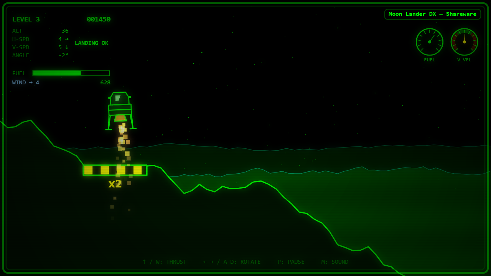
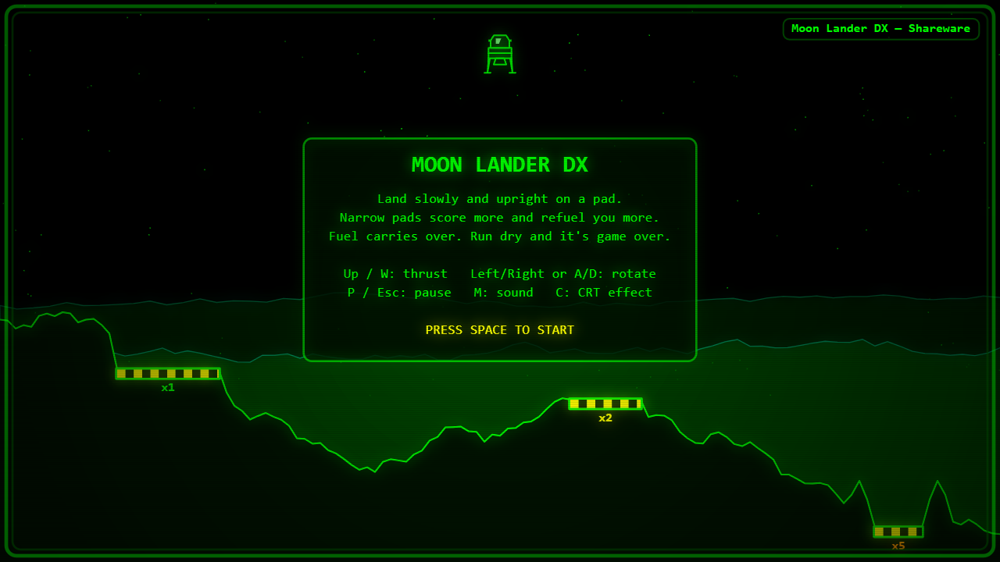
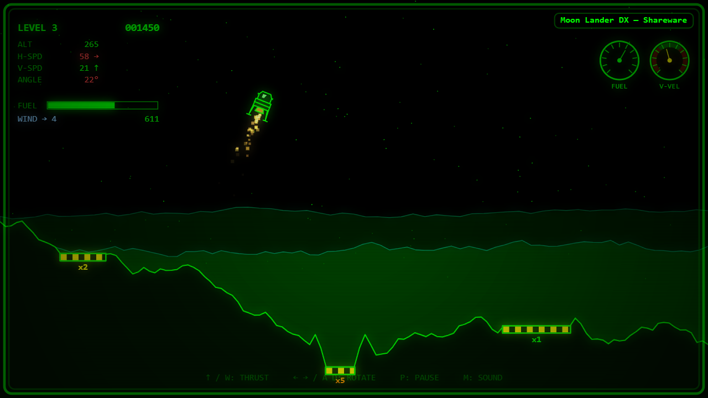
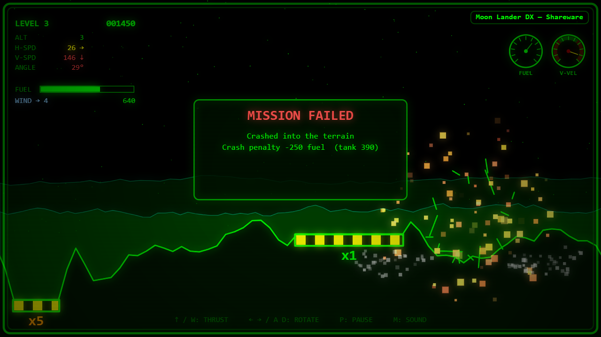
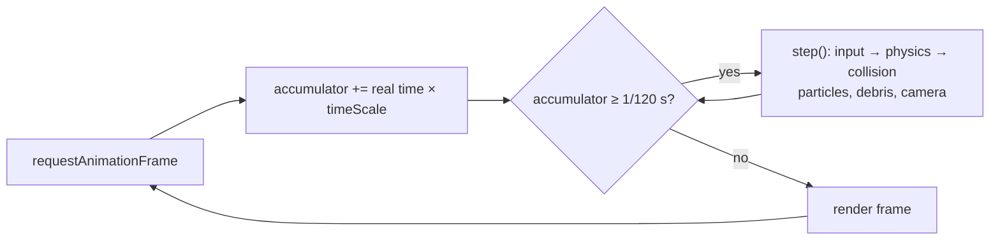
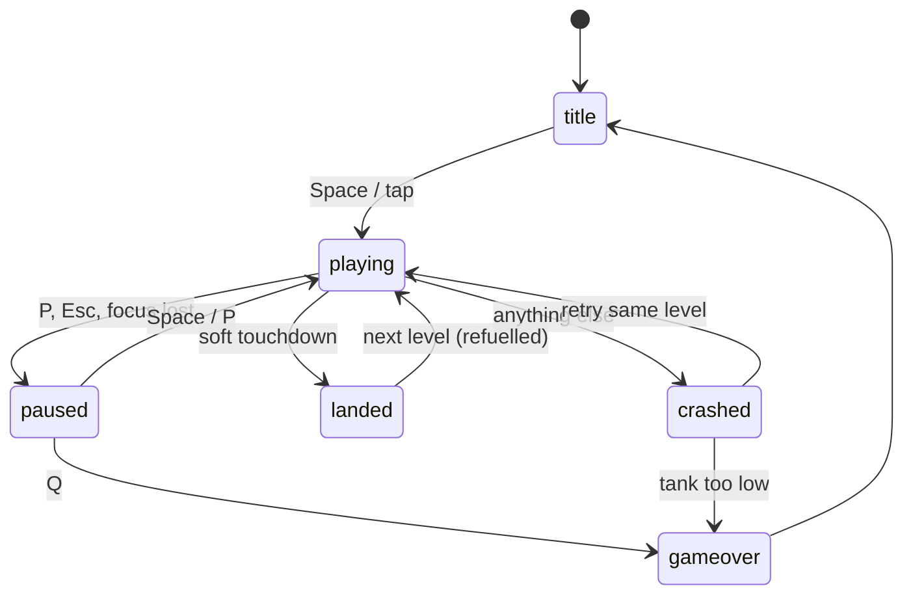
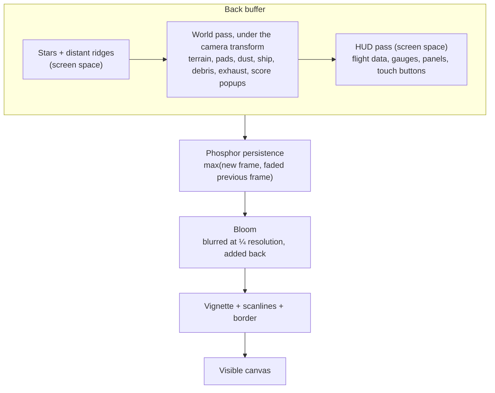
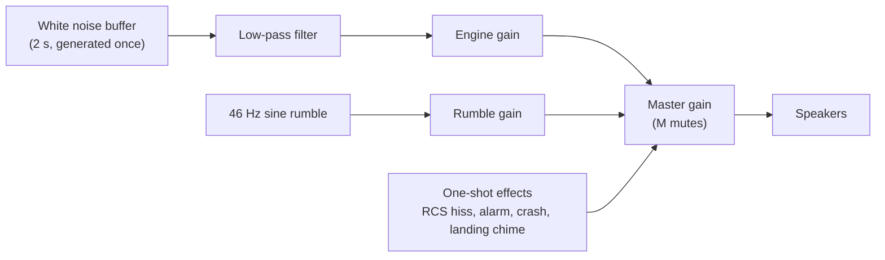

# Moon Lander DX

A retro, shareware-style lunar lander in a single HTML file: green-phosphor vector graphics, CRT glow,
generated terrain, and a fuel tank that has to last the whole run.

  

No install, no build step, no dependencies. Play it online, or download `lunar-lander-dx.html`
and open it in a browser. It works on desktop and on phones/tablets (landscape).

| | |
|---|---|
|  |  |
|  | |

## How to play

Land on a pad **slowly**, **upright** and **with both feet on the pad**.

- Every level has three pads. Wide **x1** pads are easy; narrow **x5** pads sit in valleys and are
  worth five times the points.
- Your fuel carries over from level to level. Landing refuels you, and riskier pads refuel you more.
- Crashing costs a big chunk of fuel and you retry the same level. When the tank's too low to fly,
  it's game over.
- Each level ramps up gravity and wind and shrinks the pads.

Near the ground, the camera zooms in and the HUD tells you whether you're within the landing limits:
readouts go green / amber / red, and **LANDING OK** shows when everything is safe.

### Scoring

Each landing scores `pad multiplier × (100 + soft-landing bonus + upright bonus)`, with up to 50
points for each bonus. The top five scores are saved in your browser.

## Controls

| Action | Keyboard | Touch |
|---|---|---|
| Thrust | ↑ or W | Hold **THRUST** (bottom right) |
| Rotate | ← → or A D | **◀ ▶** buttons (bottom left) |
| Start / continue | Space or Enter | Tap |
| Pause | P or Esc | **II** button |
| Quit run (when paused) | Q | **QUIT** button |
| Sound on/off | M | |
| CRT effect on/off | C | |

## Features

- Rotate-and-thrust flight with fixed-timestep physics, so it plays the same at 60Hz or 144Hz
- Generated terrain with three landing pads per level, and difficulty that ramps up
- Fuel economy across the whole run, plus scoring and a high-score table
- Arcade-style zoom camera near the ground
- Crash explosions with tumbling debris, screen shake and slow motion
- Synthesised sound (Web Audio): engine rumble, RCS hiss, low-fuel alarm, crash and landing chime
- Responsive, high-DPI canvas with touch controls
- CRT bloom and scanlines, which you can switch off for performance

## How it works

The whole game is one HTML file of about 1,400 lines: a `<canvas>`, a little CSS, and one script.
It uses only standard browser APIs (Canvas 2D, Web Audio, Pointer Events, localStorage), with no
libraries, frameworks or external assets.

### Game loop

`requestAnimationFrame` drives rendering. The simulation runs on a **fixed 120Hz timestep**: each
display frame adds the elapsed real time to an accumulator, and the loop runs as many physics steps as
fit. As a result, the ship handles the same on 60Hz and 144Hz screens. Slow motion just scales the
time fed into the accumulator. After a stall, such as switching tabs, catch-up is capped at 0.25 s.

### Game states

A small state machine decides what updates and what's drawn. A run is a sequence of levels that
share a score and a fuel tank. Each level is generated from a seed, so a retry after a crash flies
the same terrain.

### Rendering pipeline

Everything is drawn at a fixed **960×540 logical resolution**, scaled to fit the window and rendered
at device-pixel resolution so it stays sharp on high-DPI screens.

- **Camera:** a translate/scale transform on the world pass only. Below about 100 px of altitude it
  eases to 2× zoom and follows the ship, clamped so it never shows past the edge of the level.
- **CRT effect:** the persistence step keeps a separate canvas and composites each new frame with
  `lighten`. Anything that moves leaves a short fading trail, while static pixels don't brighten.
  Bloom is cheap because the blur runs on a quarter-size copy.

### Terrain and collision

- **Terrain** is a 128-segment ridge line made by midpoint displacement, using a seeded random
  number generator. Three pads are flattened into it. The narrowest, ×5 pad takes the deepest spot,
  and the ground either side is raised to form a valley.
- **Collision** tests seven points on the ship (feet, knees, body corners, top of the cabin) against
  the terrain line. A touchdown counts as a landing only if both feet are on the same pad and
  vertical speed, sideways speed and tilt are all within the limits in `CONFIG.landing`.
  Anything else is a crash, and the crash screen says which limit was broken.

### Audio

All sound is synthesised with Web Audio. Nothing is loaded from files. The audio context is
created on the first key press or tap, because browsers block sound until the player interacts.

The engine runs continuously at zero volume, and thrust fades its gain and filter cutoff up and
down. The one-shot effects are short-lived oscillators or noise bursts with their own volume
envelopes.

### Input and storage

- **Keyboard** state is tracked by `KeyboardEvent.code`, so it works the same on any keyboard
  layout. Held keys are cleared when the window loses focus.
- **Touch** uses Pointer Events. Each finger is mapped to an on-screen button, so you can rotate and
  thrust at the same time and slide between the rotate buttons. Taps and clicks also advance menus.
- **localStorage** holds the high-score table (`moonLanderDX.highScores`) and the mute and CRT
  settings. Every read and write is wrapped in `try/catch`, so the game still runs when storage is
  blocked or holds bad data.

## Tweaking

All gameplay numbers are in the `CONFIG` object at the top of the script: gravity and wind per
level, thrust, fuel, crash penalty, landing limits, pad sizes, camera zoom and effects. Change a
value, then reload the page.

Add `?debug` to the URL for an overlay with FPS, physics rate, position, speed and level settings.

To regenerate the README screenshots, open the game with `?shot=flight`, `?shot=landing` or
`?shot=crash`. Each one stages a fixed scene and freezes it.
